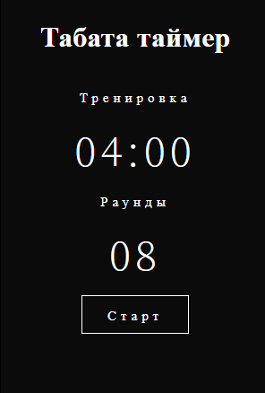
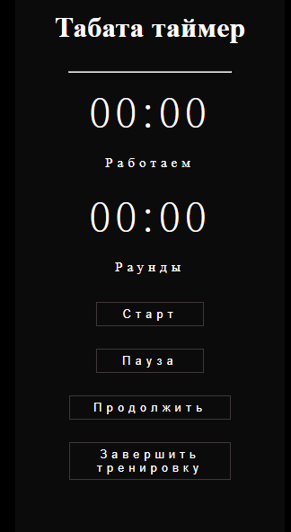

<h1>TABATA TIMER </h1>

<b>Tabata</b> is a style of high-intensity interval training.
 
 
<b>The Tabata Timer</b> is an easy to use app for high intensity interval training. It helps you to do Tabata Training in one click. It involves 20 seconds of exercise at your maximum effort, followed by 10 seconds of rest, for 8 rounds.

<h3>Features</h3>Features

- Configurable preparation;
- Workout and rest durations;
- Music and Voice assistant (the man voice count down and you don't neet to control your start and your rest)

<h3>Usage</h3>
Push the button "Старт" and enjoy your training

<h3>Contributing</h3>
Bug reports and/or pull requests are welcome.

-----

Made using HTML/CSS/JavaScript